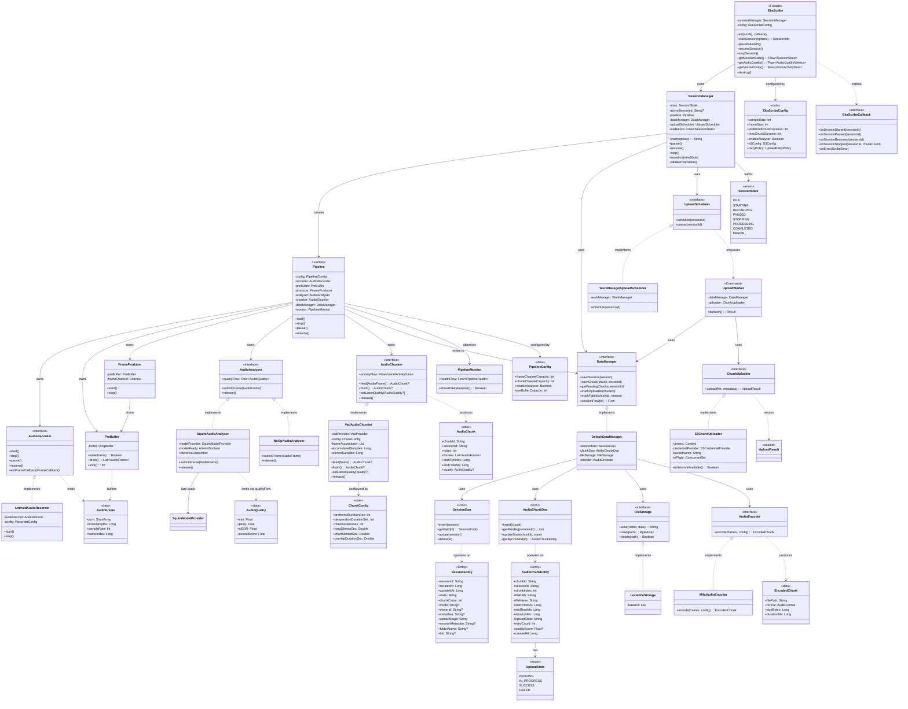

# Eka Scribe SDK - Low-Level Design (LLD)

---

## Table of Contents

1. [Design Principles](#1-design-principles)
2. [Package Structure](#2-package-structure)
3. [Design Patterns](#3-design-patterns)
4. [Class Diagrams & Relationships](#4-class-diagrams--relationships)
    - 4.1 [SDK Entry Point & Session Management](#41-sdk-entry-point--session-management)
    - 4.2 [Audio Recording Module](#42-audio-recording-module)
    - 4.3 [Audio Pipeline (Channel-based)](#43-audio-pipeline-channel-based)
    - 4.4 [Audio Analysis (SQUIM)](#44-audio-analysis-squim)
    - 4.5 [Audio Chunking (VAD)](#45-audio-chunking-vad)
    - 4.6 [Data Management & Persistence](#46-data-management--persistence)
    - 4.7 [Upload Pipeline](#47-upload-pipeline)
    - 4.8 [Backpressure & Degradation](#48-backpressure--degradation)
    - 4.9 [Configuration & Error Handling](#49-configuration--error-handling)
5. [Full Class Diagram (Mermaid)](#5-full-class-diagram-mermaid)
6. [Sequence of Construction (Object Graph)](#6-sequence-of-construction-object-graph)
7. [Data Models & Entities](#7-data-models--entities)
8. [State Machines](#8-state-machines)
9. [Thread / Coroutine Model](#9-thread--coroutine-model)
10. [Glossary](#10-glossary)

---

## 1. Design Principles

| Principle                 | Application                                                                                 |
|---------------------------|---------------------------------------------------------------------------------------------|
| **Single Responsibility** | Each class owns exactly one concern (record, analyse, chunk, persist, upload)               |
| **Dependency Inversion**  | All inter-module communication through interfaces; concrete implementations injected        |
| **Pipeline Pattern**      | Audio flows through bounded channels; each stage is independently testable                  |
| **Backpressure-aware**    | Bounded channels suspend producers when consumers are slow; no data loss                    |
| **Offline-first**         | Chunks persisted to local DB before upload; upload is a separate, retriable pipeline        |
| **Idempotent Upload**     | Chunk IDs are deterministic; re-upload is safe                                              |
| **Single Active Session** | SessionManager enforces at most one recording session at a time                             |
| **Observable State**      | Every stage exposes state via reactive streams (Flow / Observable) for host app consumption |

---

## 2. Package Structure

```
com.eka.scribesdk/
|
+-- api/                              # Public SDK surface
|   +-- EkaScribe                     # Facade (public entry point)
|   +-- EkaScribeConfig               # SDK configuration (data)
|   +-- EkaScribeCallback             # Host app lifecycle callbacks (interface)
|   +-- models/                       # Public-facing models
|       +-- SessionConfig             # Session start options (languages, mode, templates)
|       +-- AudioQualityMetrics       # Quality scores exposed to host
|       +-- ScribeError               # Error model exposed to host
|       +-- SessionState              # Observable session state enum
|       +-- SessionEventName          # Event name enum for lifecycle events
|       +-- EventType                 # Event severity enum (INFO, SUCCESS, ERROR)
|       +-- VoiceActivityData         # VAD result exposed to host
|
+-- session/                          # Session lifecycle management
|   +-- SessionManager                # Single active session orchestrator
|   +-- SessionEventEmitter           # Typed event emitter for session lifecycle
|   +-- TransactionManager            # API lifecycle (init → stop → commit → poll)
|   +-- TransactionStage              # Enum: INIT, RECORDING, STOP, COMMIT, POLL, DONE
|
+-- recorder/                         # Raw audio capture
|   +-- AudioRecorder                 # Interface
|   +-- AndroidAudioRecorder          # Android AudioRecord implementation
|   +-- AudioFrame                    # PCM data + timestamp (data)
|   +-- FrameCallback                 # fun interface for frame delivery
|   +-- AudioFocusCallback            # fun interface for audio focus events
|
+-- pipeline/                         # Channel-based audio pipeline
|   +-- Pipeline                      # Wires stages together, owns coroutines
|   +-- Pipeline.Factory              # Creates & wires pipeline for a session
|   +-- PipelineConfig                # Channel capacities, analyser toggle (data)
|   +-- FullAudioResult               # Result of full audio generation on stop (data)
|   +-- stage/
|       +-- PreBuffer                 # Lock-free ring buffer (audio thread → coroutine)
|       +-- FrameProducer             # Drains PreBuffer, sends to FrameChannel
|
+-- analyser/                         # Audio quality analysis (SQUIM)
|   +-- AudioAnalyser                 # Interface (submitFrame, qualityFlow, release)
|   +-- SquimAudioAnalyser            # SQUIM ONNX implementation (lazy model loading)
|   +-- NoOpAudioAnalyser             # Null-object fallback
|   +-- AudioQuality                  # STOI, PESQ, SI-SDR, overallScore (data)
|   +-- ModelProvider                 # Interface (load, isLoaded, unload)
|   +-- SquimModelProvider            # ONNX Runtime model loader + inference
|   +-- ModelDownloader               # CDN download with ETag caching
|   +-- AnalyserState                 # Sealed: Idle, Downloading, Ready, Failed
|
+-- chunker/                          # Voice-activity-based chunking (VAD)
|   +-- AudioChunker                  # Interface (feed, flush, setLatestQuality)
|   +-- VadAudioChunker               # Silero VAD implementation
|   +-- AudioChunk                    # Chunk data + metadata (data)
|   +-- ChunkConfig                   # Duration thresholds in seconds (data)
|   +-- VadProvider                   # Interface for VAD inference
|   +-- SileroVadProvider             # Silero VAD ONNX model loader
|
+-- encoder/                          # Audio format conversion
|   +-- AudioEncoder                  # Interface
|   +-- WavAudioEncoder               # Raw WAV encoder
|   +-- EncodedChunk                  # Encoded file + metadata (data)
|
+-- data/                             # Persistence & data management
|   +-- DataManager                   # Interface
|   +-- DefaultDataManager            # Orchestrates DB operations
|   +-- local/
|   |   +-- db/
|   |   |   +-- ScribeDatabase        # Room database holder
|   |   |   +-- dao/
|   |   |   |   +-- SessionDao        # Session CRUD
|   |   |   |   +-- AudioChunkDao     # Chunk CRUD
|   |   |   +-- entity/
|   |   |       +-- SessionEntity     # DB entity (with upload_stage, folder_name, bid)
|   |   |       +-- AudioChunkEntity  # DB entity (with retry_count, quality_score)
|   |   |       +-- UploadState       # Enum: PENDING, IN_PROGRESS, SUCCESS, FAILED
|   |   |       +-- TransactionStage  # Enum: INIT, RECORDING, STOP, COMMIT, POLL, DONE
|   +-- remote/
|       +-- api/
|       |   +-- ScribeApiService      # REST API interface (Retrofit)
|       +-- upload/
|       |   +-- ChunkUploader         # Interface
|       |   +-- S3ChunkUploader       # AWS S3 upload (network check, in-flight dedup)
|       |   +-- UploadMetadata        # Upload context (chunkId, sessionId, folderName, bid)
|       |   +-- UploadResult          # Sealed: Success(url), Failure(error, isRetryable)
|       +-- S3CredentialProvider      # Interface for obtaining S3 credentials
|
+-- common/                           # Cross-cutting concerns
    +-- error/
    |   +-- ScribeException           # Base exception with ErrorCode
    |   +-- ErrorCode                 # Enum of error codes
    +-- logging/
    |   +-- Logger                    # Interface (debug, info, warn, error)
    |   +-- DefaultLogger             # Android Log implementation
    +-- util/
        +-- IdGenerator               # UUID session IDs, deterministic chunk IDs
        +-- TimeProvider              # Interface (testable clock)
        +-- DefaultTimeProvider       # System.currentTimeMillis()
```

---

## 3. Design Patterns

### 3.1 Facade Pattern - `EkaScribe`

The single public entry point hides all internal complexity from the host application.

```
+-------------------------------------------------+
|                  EkaScribe                       |
|  (Facade)                                        |
|-------------------------------------------------|
| + init(config, callback)                         |
| + startSession(options): SessionInfo             |
| + pauseSession()                                 |
| + resumeSession()                                |
| + stopSession()                                  |
| + getSessionState(): Flow<SessionState>          |
| + getAudioQuality(): Flow<AudioQualityMetrics>   |
| + getVoiceActivity(): Flow<VoiceActivityData>    |
| + destroy()                                      |
+-------------------------------------------------+
          |
          | delegates to
          v
  +----------------+
  | SessionManager |
  +----------------+
```

### 3.2 State Machine Pattern - `SessionManager`

Session lifecycle enforced via explicit state transitions.

```
States: IDLE -> STARTING -> RECORDING -> PAUSED -> STOPPING -> PROCESSING -> COMPLETED
                                                                    |
                                                               ERROR / TERMINATED
Valid transitions:
  IDLE       -> STARTING
  STARTING   -> RECORDING, ERROR
  RECORDING  -> PAUSED, STOPPING, ERROR
  PAUSED     -> RECORDING, STOPPING
  STOPPING   -> PROCESSING
  PROCESSING -> COMPLETED, ERROR
  ERROR      -> IDLE (reset)
  COMPLETED  -> IDLE (reset)
```

### 3.3 Pipeline Pattern (Pipes and Filters)

Each processing stage is a filter connected by bounded channels (pipes). Stages are composable,
removable, and independently testable.

```
AudioRecorder --> PreBuffer --> FrameProducer --> [FrameChannel] --> AudioChunker
                                                       |                 |
                                                       v                 v
                                                SquimAudioAnalyser  [ChunkChannel]
                                               (fire-and-forget)         |
                                                                         v
                                               Encoder + DataManager + Upload
```

> **Note:** The analyser receives frames via fire-and-forget `submitFrame()` — it does
> NOT sit in the critical chunking path. Chunks flow directly from the chunker to
> persistence/upload without waiting for quality analysis.

### 3.4 Strategy Pattern

Multiple interchangeable implementations behind stable interfaces:

| Interface         | Strategies                                                        |
|-------------------|-------------------------------------------------------------------|
| `AudioRecorder`   | `AndroidAudioRecorder`, (future: `FileAudioRecorder` for testing) |
| `AudioAnalyser`   | `SquimAudioAnalyser`, `NoOpAudioAnalyser`                         |
| `AudioChunker`    | `VadAudioChunker`, `FixedDurationChunker`                         |
| `ChunkUploader`   | `S3ChunkUploader`, (future: `ApiGatewayUploader`)                 |
| `AudioEncoder`    | `M4aAudioEncoder`, (future: `OpusAudioEncoder`)                   |
| `UploadScheduler` | `WorkManagerUploadScheduler`                                      |
| `FileStorage`     | `LocalFileStorage`                                                |

### 3.5 Observer Pattern (Reactive Streams)

All observable state exposed as cold/hot streams:

```
SessionManager  -----> Flow<SessionState>
AudioAnalyser   -----> Flow<AudioQualityMetrics>
AudioChunker    -----> Flow<VoiceActivityData>
UploadWorker    -----> Flow<UploadProgress>
PipelineMonitor -----> Flow<PipelineHealth>
```

### 3.6 Repository Pattern - `DataManager`

Abstracts persistence details (DB + file system + remote) behind a single interface.

### 3.7 Factory Pattern - `Pipeline`

`Pipeline` constructs and wires all stages based on `PipelineConfig`, acting as a factory for the
processing graph.

### 3.8 Builder Pattern - `EkaScribeConfig`

Configuration built step-by-step with sensible defaults and validation.

### 3.9 Command Pattern - `UploadWorker`

Each upload job is a self-contained command with all context needed for execution and retry.

---

## 4. Class Diagrams & Relationships

### 4.1 SDK Entry Point & Session Management

```
+---------------------------+          +-----------------------------+
|       EkaScribe           |          |      EkaScribeCallback      |
|       (Facade)            |          |      <<interface>>          |
|---------------------------|          |-----------------------------|
| - sessionManager          |          | + onSessionStarted(id)      |
| - config: EkaScribeConfig |          | + onSessionPaused(id)       |
|---------------------------|          | + onSessionResumed(id)      |
| + init(config, callback)  |--------->| + onSessionStopped(id, n)   |
| + startSession(opts)      |          | + onError(ScribeError)      |
| + pauseSession()          |          +-----------------------------+
| + resumeSession()         |
| + stopSession()           |     +----------------------------------+
| + getSessionState()       |     |        EkaScribeConfig            |
| + getAudioQuality()       |     |        (data / value object)      |
| + getVoiceActivity()      |     |----------------------------------|
| + destroy()               |     | + sampleRate: Int = 16000         |
+---------------------------+     | + frameSize: Int = 512            |
          |                       | + preferredChunkDuration: Int = 10 |
          | 1 creates & owns 1   | + maxChunkDuration: Int = 25       |
          v                       | + enableAnalyser: Boolean = true   |
+---------------------------+     | + debugMode: Boolean = false       |
|    SessionManager         |
|---------------------------|     | + s3Config: S3Config               |
| - state: SessionState     |     | + retryPolicy: UploadRetryPolicy   |
| - activeSessionId: String?|     +----------------------------------+
| - pipeline: Pipeline      |
| - dataManager: DataManager|
| - uploadScheduler         |
|---------------------------|
| + start(options): String  |
| + pause()                 |
| + resume()                |
| + stop()                  |
| + stateFlow: Flow<State>  |
| - transition(new: State)  |
| - validateTransition()    |
+---------------------------+
          |
          | 1 creates 1
          v
+---------------------------+
|       Pipeline            |
|       (Factory)           |
|---------------------------|
| - config: PipelineConfig  |
| - recorder: AudioRecorder |
| - preBuffer: PreBuffer    |
| - producer: FrameProducer |
| - frameChannel            |
| - analyser: AudioAnalyser |
| - chunker: AudioChunker   |
| - chunkChannel            |
| - dataManager: DataManager|
| - monitor: PipelineMonitor|
|---------------------------|
| + start()                 |
| + stop()                  |
| + pause()                 |
| + resume()                |
+---------------------------+
```

### 4.2 Audio Recording Module

```
+---------------------------+
|     AudioRecorder         |
|     <<interface>>         |
|---------------------------|
| + start()                 |
| + stop()                  |
| + pause()                 |
| + resume()                |
| + setFrameCallback(cb)    |
+---------------------------+
          ^
          | implements
          |
+-------------------------------+       +---------------------------+
|   AndroidAudioRecorder        |       |      AudioFrame           |
|-------------------------------|       |      (data)               |
| - audioRecord: AudioRecord    |       |---------------------------|
| - recordThread: Thread        |       | + pcm: ShortArray         |
| - config: RecorderConfig      |       | + timestampMs: Long       |
| - callback: FrameCallback     |       | + sampleRate: Int         |
| - isRecording: AtomicBoolean  |       | + channels: Int           |
|-------------------------------|       | + frameIndex: Long        |
| + start()                     |------>+---------------------------+
| + stop()                      |  emits
| + pause()                     |
| + resume()                    |       +---------------------------+
| + setFrameCallback(cb)        |       |    RecorderConfig         |
+-------------------------------+       |    (data)                 |
                                        |---------------------------|
+---------------------------+           | + sampleRate: Int = 16000 |
|    FrameCallback          |           | + channels: Int = 1       |
|    <<fun interface>>      |           | + encoding: Int = PCM_16  |
|---------------------------|           | + frameSize: Int = 512    |
| + onFrame(AudioFrame)     |           +---------------------------+
+---------------------------+
```

### 4.3 Audio Pipeline (Channel-based)

```
+----------------------------------+
|         PipelineStage<I, O>      |
|         <<interface>>            |
|----------------------------------|
| + process(input: I): O           |
| + start()                        |
| + stop()                         |
+----------------------------------+
          ^            ^           ^
          |            |           |
+---------+--+   +-----+------+  +-------+----------+
| PreBuffer  |   | AudioAnalyser|  | AudioChunker    |
+------------+   +--------------+  +-----------------+

                     PIPELINE WIRING

+------------+    +-------------+    +==============+    +--------------+
| AudioRec.  |--->| PreBuffer   |--->| FrameChannel |--->| AudioAnalyser|
| (thread)   |    | (ring buf)  |    | (bounded ch) |    |              |
+------------+    +-------------+    +==============+    +--------------+
                                                                |
                                                                v
+--------------+    +==============+    +-------------------+   |
| DataManager  |<---| ChunkChannel |<---| AudioChunker      |<--+
|              |    | (bounded ch) |    | (VAD)             |
+--------------+    +==============+    +-------------------+
       |
       v
+--------------+
| FileStorage  |
+--------------+


+---------------------------+       +---------------------------+
|      PreBuffer            |       |      PipelineConfig       |
|---------------------------|       |      (data)               |
| - buffer: RingBuffer      |       |---------------------------|
| - capacity: Int            |       | + frameChannelCapacity    |
|---------------------------|       | + chunkChannelCapacity    |
| + write(frame): Boolean   |       | + enableAnalyser: Boolean |
| + drain(): List<AudioFrame>|      | + preBufferCapacity: Int  |
| + size(): Int             |       +---------------------------+
| + isFull(): Boolean       |
+---------------------------+

+---------------------------+       +---------------------------+
|    FrameProducer          |       |     PipelineMonitor       |
|    (Coroutine)            |       |---------------------------|
|---------------------------|       | - frameChannelLoad: Float |
| - preBuffer: PreBuffer    |       | - chunkChannelLoad: Float |
| - frameChannel: Channel   |       | - memoryUsage: Long       |
| - scope: CoroutineScope   |       |---------------------------|
|---------------------------|       | + healthFlow: Flow<Health>|
| + start()                 |       | + shouldSkipAnalyser()    |
| + stop()                  |
+---------------------------+       | + shouldPauseChunking()   |
                                    +---------------------------+
```

### 4.4 Audio Analysis (SQUIM)

The SQUIM analyser runs **independently** from the main pipeline data path.
Frames are submitted via fire-and-forget `submitFrame()`. The ONNX model is loaded
**lazily** in a background coroutine so it does not block session startup — frames
submitted before the model is ready are silently dropped.

```
+---------------------------+
|     AudioAnalyser         |
|     <<interface>>         |
|---------------------------|
| + submitFrame(AudioFrame) |
| + qualityFlow:            |
|     Flow<AudioQuality>    |
| + release()               |
+---------------------------+
          ^
          | implements
          |
+---+-----+----+
|              |
|              |
+------v-------+      +----v-----------+
|SquimAudio    |      | NoOpAudio      |
|Analyser      |      | Analyser       |
|--------------|      |----------------|
|- modelProvider|     | (all no-ops)   |
|- modelReady:  |     +----------------+
|  AtomicBoolean|
|- inferenceDisp|
|  atcher       |
|---------------|      LAZY LOADING:
|+ submitFrame()|      init { scope.launch {
|+ qualityFlow  |        modelProvider.load()
|+ release()    |        modelReady.set(true)
+---------------+      }}
       |
       | uses
       v
+---------------------------+     +---------------------------+
|     ModelProvider          |     |     AudioQuality          |
|     <<interface>>         |     |     (data)                |
|---------------------------|     |---------------------------|
| + load()                  |     | + stoi: Float            |
| + isLoaded(): Boolean     |     | + pesq: Float            |
| + unload()                |     | + siSDR: Float           |
+---------------------------+     | + overallScore: Float    |
          ^                       +---------------------------+
          |
+---------------------------+     +---------------------------+
|   SquimModelProvider      |     |   ModelDownloader         |
|---------------------------|     |---------------------------|
| - modelPath: String       |     | - filesDir: File         |
| - env: OrtEnvironment     |     | - api: ModelDownloadApi  |
| - session: OrtSession     |     |---------------------------|
|---------------------------|     | + downloadModelIfNeeded()|
| + load()                  |     | + isModelDownloaded()    |
| + analyse(FloatArray):    |     | + getModelPath(): String?|
|     AudioQuality?         |     | + stateFlow: StateFlow   |
| + unload()                |     +---------------------------+
+---------------------------+
```

### 4.5 Audio Chunking (VAD)

The chunker receives raw `AudioFrame`s (not analysed frames) from the pipeline.
Latest quality from the analyser is forwarded separately via `setLatestQuality()`.

```
+-------------------------------+
|       AudioChunker            |
|       <<interface>>           |
|-------------------------------|
| + feed(frame: AudioFrame):   |
|     AudioChunk?               |
| + flush(): AudioChunk?        |
| + setLatestQuality(quality?)  |
| + activityFlow:               |
|     Flow<VoiceActivityData>   |
| + release()                   |
+-------------------------------+
          ^
          | implements
          |
+-------------------------------+     +---------------------------+
|    VadAudioChunker            |     |     AudioChunk            |
|-------------------------------|     |     (data)                |
| - vadProvider: VadProvider    |     |---------------------------|
| - config: ChunkConfig        |     | + chunkId: String         |
| - frameAccumulator: List     |     | + sessionId: String       |
| - accumulatedSamples: Long   |     | + index: Int              |
| - silenceSamples: Long       |     | + frames: List<AudioFrame>|
| - totalSamplesProcessed: Long|     | + startTimeMs: Long       |
| - chunkStartSampleOffset: Long|    | + endTimeMs: Long         |
| - latestQuality: AudioQuality?|    | + quality: AudioQuality?  |
|-------------------------------|     | + durationMs: Long (comp.)|
| + feed(frame): AudioChunk?   |     +---------------------------+
| + flush(): AudioChunk?       |
| + setLatestQuality(quality?) |
| + activityFlow               |
| + release()                  |
| - shouldChunk(): Boolean     |
| - createChunk(): AudioChunk  |
| - calculateAmplitude(pcm)    |
+-------------------------------+
       |
       | uses
       v
+-------------------------------+     +---------------------------+
|       VadProvider             |     |      ChunkConfig          |
|       <<interface>>           |     |      (data)               |
|-------------------------------|     |---------------------------|
| + load()                     |     | + preferredDurationSec: 10|
| + detect(pcm): VadResult     |     | + desperationDurationSec:20|
| + unload()                   |     | + maxDurationSec: 25      |
+-------------------------------+     | + longSilenceSec: 0.5     |
          ^                           | + shortSilenceSec: 0.1    |
          |                           | + overlapDurationSec: 0.5 |
+-------------------------------+     +---------------------------+
|    SileroVadProvider          |
|-------------------------------|     +---------------------------+
| - modelPath: String          |     |    VoiceActivityData      |
| - session: OrtSession        |     |    (data)                 |
+-------------------------------+     |---------------------------|
                                      | + isSpeech: Boolean       |
                                      | + amplitude: Float        |
                                      | + timestampMs: Long       |
                                      +---------------------------+
```

**Chunking Decision Logic (sample-based):**

```
IF accumulatedSamples > prefLengthSamples AND silenceSamples > longSilenceThreshold:
    -> CREATE CHUNK (natural break)
ELSE IF accumulatedSamples > despLengthSamples AND silenceSamples > shortSilenceThreshold:
    -> CREATE CHUNK (desperation cut)
ELSE IF accumulatedSamples >= maxLengthSamples:
    -> CREATE CHUNK (force cut)
```

> **Overlap:** On chunk creation (non-flush), the last `overlapDurationSec` worth of
> frames are kept for the next chunk to ensure no audio is lost at boundaries.

### 4.6 Data Management & Persistence

```
+-------------------------------+
|       DataManager             |
|       <<interface>>           |
|-------------------------------|
| + saveSession(session)        |
| + saveChunk(chunk, encoded)   |
| + getPendingChunks(sessionId):|
|     List<AudioChunkEntity>    |
| + markUploaded(chunkId)       |
| + markFailed(chunkId, reason) |
| + getSession(id): Session     |
| + updateSessionState(id, st)  |
| + sessionFlow(id):            |
|     Flow<SessionEntity>       |
| + deleteSession(id)           |
+-------------------------------+
          ^
          | implements
          |
+-------------------------------+
|    DefaultDataManager         |
|-------------------------------|
| - sessionDao: SessionDao      |
| - chunkDao: AudioChunkDao     |
| - fileStorage: FileStorage    |
| - encoder: AudioEncoder       |
| - idGenerator: IdGenerator    |
|-------------------------------|
| + saveChunk(chunk, encoded)   |
|   1. encode to M4A            |
|   2. write file to disk       |
|   3. insert entity (PENDING)  |
| + markUploaded(chunkId)       |
|   1. update uploadState       |
|   2. (optionally) delete file |
+-------------------------------+
       |            |
       v            v
+-------------+ +------------------+
| SessionDao  | | AudioChunkDao    |
| <<DAO>>     | | <<DAO>>          |
|-------------| |------------------|
| + insert()  | | + insert()       |
| + getById() | | + getBySession() |
| + update()  | | + getPending()   |
| + delete()  | | + updateState()  |
| + getAll()  | | + getByChunkId() |
| + observe() | | + delete()       |
+-------------+ +------------------+

+-------------------------------+
|       FileStorage             |
|       <<interface>>           |
|-------------------------------|
| + write(name, data): FilePath |
| + read(path): ByteArray       |
| + delete(path): Boolean       |
| + exists(path): Boolean       |
+-------------------------------+
          ^
          |
+-------------------------------+
|    LocalFileStorage           |
|-------------------------------|
| - baseDir: File               |
+-------------------------------+

+-------------------------------+
|     AudioEncoder              |
|     <<interface>>             |
|-------------------------------|
| + encode(frames, config):     |
|     EncodedChunk              |
+-------------------------------+
          ^
          |
+-------------------------------+     +---------------------------+
|    M4aAudioEncoder            |     |    EncodedChunk           |
|-------------------------------|     |    (data)                 |
| - Uses MediaCodec + Muxer    |     |---------------------------|
+-------------------------------+     | + filePath: String        |
                                      | + format: AudioFormat     |
                                      | + sizeBytes: Long         |
                                      | + durationMs: Long        |
                                      +---------------------------+
```

### 4.7 Upload Pipeline

```
+-------------------------------+
|     UploadScheduler           |
|     <<interface>>             |
|-------------------------------|
| + schedule(sessionId)         |
| + cancel(sessionId)           |
| + cancelAll()                 |
+-------------------------------+
          ^
          |
+-------------------------------+
| WorkManagerUploadScheduler    |     +---------------------------+
|-------------------------------|     |    UploadRetryPolicy      |
| - workManager: WorkManager    |     |    (data)                 |
|-------------------------------|     |---------------------------|
| + schedule(sessionId)         |---->| + maxRetries: Int = 5     |
|   1. create OneTimeWorkReq.   |     | + initialBackoffSec: Long |
|   2. set constraints (NET)    |     | + backoffMultiplier: Float|
|   3. enqueue unique work      |     | + maxBackoffSec: Long     |
| + cancel(sessionId)           |     +---------------------------+
+-------------------------------+
          |
          | enqueues
          v
+-------------------------------+
|      UploadWorker             |
|      (Command)                |
|-------------------------------|
| - dataManager: DataManager    |
| - uploader: ChunkUploader    |
|-------------------------------|
| + doWork(): Result            |
|   1. get pending chunks       |
|   2. for each chunk:          |
|      a. upload(chunk)         |
|      b. markUploaded / Failed |
|   3. return success/retry     |
+-------------------------------+
          |
          | uses
          v
+-------------------------------+
|     ChunkUploader             |
|     <<interface>>             |
|-------------------------------|
| + upload(file, metadata):     |
|     UploadResult              |
+-------------------------------+
          ^
          |
+-------------------------------+     +---------------------------+
|    S3ChunkUploader            |     |    UploadResult           |
|-------------------------------|     |    (sealed)               |
| - context: Context            |     |---------------------------|
| - credentialProvider          |     | + Success(url: String)    |
| - bucketName: String          |     | + Failure(error, retryable)|
| - inFlight: ConcurrentSet     |     +---------------------------+
|-------------------------------|
| + upload(file, metadata)      |
|   1. check network available  |
|   2. guard in-flight dedup    |
|   3. uploadWithRetry()        |
| - isNetworkAvailable(): Bool  |
| + clearCache()                |
+-------------------------------+

+-------------------------------+
|     UploadMetadata            |
|     (data)                    |
|-------------------------------|
| + chunkId: String             |
| + sessionId: String           |
| + chunkIndex: Int             |
| + fileName: String            |
| + folderName: String          |
| + bid: String                 |
| + mimeType: String = audio/wav|
+-------------------------------+
```

### 4.8 Backpressure & Degradation

```
+-------------------------------+
|    SystemLoadMonitor          |
|-------------------------------|
| - frameChannel: Channel       |
| - chunkChannel: Channel       |
| - runtime: Runtime            |
|-------------------------------|
| + frameChannelLoad(): Float   |  // 0.0 - 1.0
| + chunkChannelLoad(): Float   |  // 0.0 - 1.0
| + memoryPressure(): Float     |  // 0.0 - 1.0
| + healthFlow: Flow<Health>    |
+-------------------------------+
          |
          | feeds
          v
+-------------------------------+
|    DegradationPolicy          |
|-------------------------------|
| + evaluate(health):           |
|     PipelineConfig            |  // returns adjusted config
|-------------------------------|
| Rules:                        |
|  frameQueue > 80% ->          |
|    skip analyser              |
|  chunkQueue > 80% ->          |
|    pause chunking             |
|  memory high ->               |
|    reduce buffer sizes        |
+-------------------------------+

+-------------------------------+
|    PipelineHealth             |
|    (data)                     |
|-------------------------------|
| + frameQueueUtilization: Float|
| + chunkQueueUtilization: Float|
| + memoryUsageMb: Long         |
| + isDegraded: Boolean         |
| + activeStages: Set<Stage>    |
+-------------------------------+
```

### 4.9 Configuration & Error Handling

```
+-------------------------------+     +---------------------------+
|       ScribeException         |     |      ErrorCode            |
|       (base exception)        |     |      (enum)               |
|-------------------------------|     |---------------------------|
| + code: ErrorCode             |     | MIC_PERMISSION_DENIED     |
| + message: String             |     | SESSION_ALREADY_ACTIVE    |
| + cause: Throwable?           |     | INVALID_CONFIG            |
+-------------------------------+     | ENCODER_FAILED            |
                                      | UPLOAD_FAILED             |
+-------------------------------+     | MODEL_LOAD_FAILED         |
|       ScribeError             |     | NETWORK_UNAVAILABLE       |
|       (data - public API)     |     | DB_ERROR                  |
|-------------------------------|     | UNKNOWN                   |
| + code: ErrorCode             |     +---------------------------+
| + message: String             |
| + isRecoverable: Boolean      |
+-------------------------------+

+-------------------------------+
|     IdGenerator               |
|-------------------------------|
| + sessionId(): String         |  // UUID-based
| + chunkId(sessionId,          |
|     index): String            |  // deterministic: "{sessionId}_{index}"
+-------------------------------+

+-------------------------------+
|     TimeProvider              |
|     <<interface>>             |
|-------------------------------|
| + nowMillis(): Long           |
| + nowFormatted(): String      |
+-------------------------------+
```

---

## 5. Full Class Diagram (Mermaid)


```mermaid
classDiagram
    direction TB

    %% ===== PUBLIC API =====
    class EkaScribe {
        <<Facade>>
        -sessionManager: SessionManager
        -config: EkaScribeConfig
        +init(config, callback)
        +startSession(options): SessionInfo
        +pauseSession()
        +resumeSession()
        +stopSession()
        +getSessionState(): Flow~SessionState~
        +getAudioQuality(): Flow~AudioQualityMetrics~
        +getVoiceActivity(): Flow~VoiceActivityData~
        +destroy()
    }

    class EkaScribeCallback {
        <<interface>>
        +onSessionStarted(sessionId)
        +onSessionPaused(sessionId)
        +onSessionResumed(sessionId)
        +onSessionStopped(sessionId, chunkCount)
        +onError(ScribeError)
    }

    class EkaScribeConfig {
        <<data>>
        +sampleRate: Int
        +frameSize: Int
        +preferredChunkDuration: Int
        +maxChunkDuration: Int
        +enableAnalyser: Boolean
        +s3Config: S3Config
        +retryPolicy: UploadRetryPolicy
    }

    %% ===== SESSION =====
    class SessionManager {
        -state: SessionState
        -activeSessionId: String?
        -pipeline: Pipeline
        -dataManager: DataManager
        -uploadScheduler: UploadScheduler
        +start(options): String
        +pause()
        +resume()
        +stop()
        +stateFlow: Flow~SessionState~
        -transition(newState)
        -validateTransition()
    }

    class SessionState {
        <<enum>>
        IDLE
        STARTING
        RECORDING
        PAUSED
        STOPPING
        PROCESSING
        COMPLETED
        ERROR
    }

    %% ===== PIPELINE =====
    class Pipeline {
        <<Factory>>
        -config: PipelineConfig
        -recorder: AudioRecorder
        -preBuffer: PreBuffer
        -producer: FrameProducer
        -analyser: AudioAnalyser
        -chunker: AudioChunker
        -dataManager: DataManager
        -monitor: PipelineMonitor
        +start()
        +stop()
        +pause()
        +resume()
    }

    class PipelineConfig {
        <<data>>
        +frameChannelCapacity: Int
        +chunkChannelCapacity: Int
        +enableAnalyser: Boolean
        +preBufferCapacity: Int
    }

    class PipelineMonitor {
        +healthFlow: Flow~PipelineHealth~
        +shouldSkipAnalyser(): Boolean
    }

    %% ===== RECORDER =====
    class AudioRecorder {
        <<interface>>
        +start()
        +stop()
        +pause()
        +resume()
        +setFrameCallback(FrameCallback)
    }

    class AndroidAudioRecorder {
        -audioRecord: AudioRecord
        -config: RecorderConfig
        +start()
        +stop()
    }

    class AudioFrame {
        <<data>>
        +pcm: ShortArray
        +timestampMs: Long
        +sampleRate: Int
        +frameIndex: Long
    }

    %% ===== PREBUFFER =====
    class PreBuffer {
        -buffer: RingBuffer
        +write(frame): Boolean
        +drain(): List~AudioFrame~
        +size(): Int
    }

    class FrameProducer {
        -preBuffer: PreBuffer
        -frameChannel: Channel
        +start()
        +stop()
    }

    %% ===== ANALYSER =====
    class AudioAnalyser {
        <<interface>>
        +submitFrame(AudioFrame)
        +qualityFlow: Flow~AudioQuality~
        +release()
    }

    class SquimAudioAnalyser {
        -modelProvider: SquimModelProvider
        -modelReady: AtomicBoolean
        -inferenceDispatcher
        +submitFrame(AudioFrame)
        +release()
    }

    class NoOpAudioAnalyser {
        +submitFrame(AudioFrame)
        +release()
    }

    class AudioQuality {
        <<data>>
        +stoi: Float
        +pesq: Float
        +siSDR: Float
        +overallScore: Float
    }

    %% ===== CHUNKER =====
    class AudioChunker {
        <<interface>>
        +feed(AudioFrame): AudioChunk?
        +flush(): AudioChunk?
        +setLatestQuality(AudioQuality?)
        +activityFlow: Flow~VoiceActivityData~
        +release()
    }

    class VadAudioChunker {
        -vadProvider: VadProvider
        -config: ChunkConfig
        -frameAccumulator: List
        -accumulatedSamples: Long
        -silenceSamples: Long
        +feed(frame): AudioChunk?
        +flush(): AudioChunk?
        +setLatestQuality(quality?)
        +release()
    }

    class AudioChunk {
        <<data>>
        +chunkId: String
        +sessionId: String
        +index: Int
        +frames: List~AudioFrame~
        +startTimeMs: Long
        +endTimeMs: Long
        +quality: AudioQuality?
    }

    class ChunkConfig {
        <<data>>
        +preferredDurationSec: Int
        +desperationDurationSec: Int
        +maxDurationSec: Int
        +longSilenceSec: Double
        +shortSilenceSec: Double
        +overlapDurationSec: Double
    }

    %% ===== ENCODER =====
    class AudioEncoder {
        <<interface>>
        +encode(frames, config): EncodedChunk
    }

    class M4aAudioEncoder {
        +encode(frames, config): EncodedChunk
    }

    class EncodedChunk {
        <<data>>
        +filePath: String
        +format: AudioFormat
        +sizeBytes: Long
        +durationMs: Long
    }

    %% ===== DATA =====
    class DataManager {
        <<interface>>
        +saveSession(session)
        +saveChunk(chunk, encoded)
        +getPendingChunks(sessionId)
        +markUploaded(chunkId)
        +markFailed(chunkId, reason)
        +sessionFlow(id): Flow
    }

    class DefaultDataManager {
        -sessionDao: SessionDao
        -chunkDao: AudioChunkDao
        -fileStorage: FileStorage
        -encoder: AudioEncoder
    }

    class SessionDao {
        <<DAO>>
        +insert(session)
        +getById(id): SessionEntity
        +update(session)
        +delete(id)
    }

    class AudioChunkDao {
        <<DAO>>
        +insert(chunk)
        +getPending(sessionId): List
        +updateState(chunkId, state)
        +getByChunkId(id): AudioChunkEntity
    }

    class SessionEntity {
        <<Entity>>
        +sessionId: String
        +createdAt: Long
        +updatedAt: Long
        +state: String
        +chunkCount: Int
        +mode: String?
        +ownerId: String?
        +metadata: String?
        +uploadStage: String
        +sessionMetadata: String?
        +folderName: String?
        +bid: String?
    }

    class AudioChunkEntity {
        <<Entity>>
        +chunkId: String
        +sessionId: String
        +chunkIndex: Int
        +filePath: String
        +fileName: String
        +startTimeMs: Long
        +endTimeMs: Long
        +durationMs: Long
        +uploadState: String
        +retryCount: Int
        +qualityScore: Float?
        +createdAt: Long
    }

    class UploadState {
        <<enum>>
        PENDING
        IN_PROGRESS
        SUCCESS
        FAILED
    }

    class FileStorage {
        <<interface>>
        +write(name, data): String
        +read(path): ByteArray
        +delete(path): Boolean
    }

    class LocalFileStorage {
        -baseDir: File
    }

    %% ===== UPLOAD =====
    class UploadScheduler {
        <<interface>>
        +schedule(sessionId)
        +cancel(sessionId)
    }

    class WorkManagerUploadScheduler {
        -workManager: WorkManager
        +schedule(sessionId)
    }

    class UploadWorker {
        <<Command>>
        -dataManager: DataManager
        -uploader: ChunkUploader
        +doWork(): Result
    }

    class ChunkUploader {
        <<interface>>
        +upload(file, metadata): UploadResult
    }

    class S3ChunkUploader {
        -context: Context
        -credentialProvider: S3CredentialProvider
        -bucketName: String
        -inFlight: ConcurrentSet
        +isNetworkAvailable(): Boolean
    }

    class UploadResult {
        <<sealed>>
    }

    %% ===== RELATIONSHIPS =====
    EkaScribe --> SessionManager : owns
    EkaScribe --> EkaScribeConfig : configured by
    EkaScribe ..> EkaScribeCallback : notifies

    SessionManager --> Pipeline : creates
    SessionManager --> DataManager : uses
    SessionManager --> UploadScheduler : uses
    SessionManager --> SessionState : tracks

    Pipeline --> AudioRecorder : owns
    Pipeline --> PreBuffer : owns
    Pipeline --> FrameProducer : owns
    Pipeline --> AudioAnalyser : owns
    Pipeline --> AudioChunker : owns
    Pipeline --> DataManager : writes to
    Pipeline --> PipelineMonitor : observes
    Pipeline --> PipelineConfig : configured by

    AudioRecorder <|.. AndroidAudioRecorder : implements
    AudioRecorder ..> AudioFrame : emits

    PreBuffer ..> AudioFrame : buffers
    FrameProducer --> PreBuffer : drains

    AudioAnalyser <|.. SquimAudioAnalyser : implements
    AudioAnalyser <|.. NoOpAudioAnalyser : implements
    SquimAudioAnalyser --> SquimModelProvider : lazy loads
    SquimAudioAnalyser ..> AudioQuality : emits via qualityFlow

    AudioChunker <|.. VadAudioChunker : implements
    AudioChunker ..> AudioChunk : produces
    VadAudioChunker --> ChunkConfig : configured by

    AudioEncoder <|.. M4aAudioEncoder : implements
    AudioEncoder ..> EncodedChunk : produces

    DataManager <|.. DefaultDataManager : implements
    DefaultDataManager --> SessionDao : uses
    DefaultDataManager --> AudioChunkDao : uses
    DefaultDataManager --> FileStorage : uses
    DefaultDataManager --> AudioEncoder : uses

    FileStorage <|.. LocalFileStorage : implements

    SessionDao ..> SessionEntity : operates on
    AudioChunkDao ..> AudioChunkEntity : operates on
    AudioChunkEntity --> UploadState : has

    UploadScheduler <|.. WorkManagerUploadScheduler : implements
    UploadScheduler ..> UploadWorker : enqueues
    UploadWorker --> DataManager : uses
    UploadWorker --> ChunkUploader : uses

    ChunkUploader <|.. S3ChunkUploader : implements
    ChunkUploader ..> UploadResult : returns
```

---

## 6. Sequence of Construction (Object Graph)

When `EkaScribe.init()` is called, the object graph is constructed in this order:

```
1. EkaScribeConfig          (provided by host app)
2. Logger                   (from config or default)
3. TimeProvider             (DefaultTimeProvider)
4. ScribeDatabase           (Room, lazy singleton)
5. SessionDao, AudioChunkDao (from database)
6. DefaultDataManager       (sessionDao, chunkDao)
7. S3CredentialProvider      (from config)
8. S3ChunkUploader           (context, credentialProvider, bucketName)
9. ScribeApiService          (Retrofit)
10. TransactionManager       (apiService, dataManager, chunkUploader, ...)
11. Pipeline.Factory         (context, pipelineConfig, modelDownloader, ...)
12. SessionManager           (pipelineFactory, transactionManager, dataManager, ...)

--- On start(sessionConfig) ---   (suspend function)

13. Init API call             (TransactionManager.initTransaction → bid, folderName)
14. AndroidAudioRecorder      (context, sampleRate, frameSize)
15. PreBuffer                 (capacity: 2000 frames)
16. FrameProducer             (preBuffer, frameChannel)
17. SileroVadProvider.load()  (synchronous — required for chunking)
18. VadAudioChunker           (vadProvider, chunkConfig, sessionId)
19. SquimModelProvider        (modelPath) — NOT loaded yet
20. SquimAudioAnalyser        (modelProvider, scope)
    └─ init {} launches background model loading on inferenceDispatcher
21. Pipeline                  (all of the above wired together)
22. Pipeline.start()          (starts recorder + coroutines)
23. startFlowCollection()     (non-blocking flow collectors launched in scope)
```

---

## 7. Data Models & Entities

### 7.1 Database Schema

```
+============================+          +=============================+
| scribe_session_table       |          | scribe_audio_chunk_table    |
|============================|          |=============================|
| PK session_id: TEXT        |<----+    | PK chunk_id: TEXT           |
|    created_at: INTEGER     |     |    | FK session_id: TEXT ------->+
|    updated_at: INTEGER     |     |    |    chunk_index: INTEGER     |
|    state: TEXT             |     |    |    file_path: TEXT          |
|    chunk_count: INTEGER    |     |    |    file_name: TEXT          |
|    mode: TEXT              |     |    |    start_time_ms: INTEGER   |
|    owner_id: TEXT          |     |    |    end_time_ms: INTEGER     |
|    metadata: TEXT (JSON)   |     |    |    duration_ms: INTEGER     |
|    upload_stage: TEXT      |     |    |    upload_state: TEXT       |
|    session_metadata: TEXT  |     |    |    retry_count: INTEGER     |
|    folder_name: TEXT       |     |    |    quality_score: REAL      |
|    bid: TEXT               |     |    |    created_at: INTEGER      |
+============================+     |    +=============================+
                                   |
                                   |    (CASCADE DELETE on session removal)
```

### 7.2 Upload State Transitions

```
PENDING --> IN_PROGRESS --> SUCCESS
                |
                v
             FAILED --> IN_PROGRESS  (retry)
                |
                v (max retries exceeded)
          PERMANENTLY_FAILED
```

### 7.3 Data Flow Through Pipeline

```
ShortArray (raw PCM)
    |
    v
AudioFrame { pcm, timestamp, sampleRate, frameIndex }
    |
    +------> SquimAudioAnalyser.submitFrame()     (fire-and-forget, async)
    |             |                                qualityFlow --> chunker
    v             v
AudioChunker.feed(frame)         quality forwarded via setLatestQuality()
    |
    v
AudioChunk { chunkId, sessionId, index, frames[], startTime, endTime, quality? }
    |
    v  (AudioEncoder)
EncodedChunk { filePath, format, sizeBytes, durationMs }
    |
    v  (DataManager)
AudioChunkEntity { chunkId, sessionId, filePath, uploadState=PENDING, ... }
    |
    v  (S3ChunkUploader — with network check + in-flight dedup)
UploadResult.Success { url }  -->  AudioChunkEntity { uploadState=SUCCESS }
```

---

## 8. State Machines

### 8.1 Session State Machine

```
                              +----------+
                    +-------->|  ERROR   |--------+
                    |         +----------+        |
                    |              ^               |
                    |              |               v
+------+     +---------+    +-----------+    +------+
| IDLE |---->|STARTING |---->|RECORDING |---->| IDLE |
+------+     +---------+    +-----------+    +------+
   ^                           |    ^             ^
   |                           v    |             |
   |                        +--------+            |
   |                        | PAUSED |            |
   |                        +--------+            |
   |                           |                  |
   |                           v                  |
   |                       +----------+           |
   |                       | STOPPING |           |
   |                       +----------+           |
   |                           |                  |
   |                           v                  |
   |                      +------------+          |
   |                      | PROCESSING |----------+
   |                      +------------+
   |                           |
   |                           v
   |                      +-----------+
   +----------------------| COMPLETED |
                          +-----------+
```

### 8.2 Upload State Machine (per chunk)

```
+---------+     +--------------+     +---------+
| PENDING |---->| IN_PROGRESS  |---->| SUCCESS |
+---------+     +--------------+     +---------+
                      |
                      v
                 +--------+    retry (count < max)
                 | FAILED |------------------------+
                 +--------+                        |
                      |                            v
                      | (count >= max)     +--------------+
                      v                    | IN_PROGRESS  |
              +------------------+         +--------------+
              | PERM_FAILED      |
              +------------------+
```

---

## 9. Thread / Coroutine Model

```
+=====================================================+
|                    THREADS                           |
+=====================================================+

[Audio Thread]          - Dedicated OS thread
  AudioRecorder reads PCM frames at real-time speed
  Writes to PreBuffer (lock-free, never blocks)

[Producer Coroutine]    - Dispatchers.Default
  Drains PreBuffer in loop
  Sends frames to FrameChannel (suspends on backpressure)

[Chunking Coroutine]    - Dispatchers.Default
  Receives from FrameChannel
  Calls analyser.submitFrame() (fire-and-forget)
  Feeds frame to AudioChunker
  Sends resulting chunks to ChunkChannel

[SQUIM Inference Thread] - Single thread (inferenceDispatcher)
  Model loading (lazy, on construction)
  Runs ONNX inference every 3s of accumulated audio
  Publishes AudioQuality to qualityFlow
  Android THREAD_PRIORITY_BACKGROUND for CPU throttling

[Quality Forward Coroutine] - Dispatchers.Default
  Collects analyser.qualityFlow
  Calls chunker.setLatestQuality() so chunks carry metrics

[Persistence Coroutine] - Dispatchers.Default
  Receives from ChunkChannel
  Encodes to WAV
  Persists AudioChunkEntity to Room DB
  Immediately uploads via S3ChunkUploader

+=====================================================+
|            CHANNEL CAPACITIES                        |
+=====================================================+

PreBuffer (Ring):    2000 frames  (~64s at 16kHz/512)
FrameChannel:        640 frames   (~20s buffer)
ChunkChannel:        80 chunks    (~800-2000s of audio)
```

---

## 10. Glossary

| Term                  | Definition                                                                                  |
|-----------------------|---------------------------------------------------------------------------------------------|
| **PCM**               | Pulse-Code Modulation; raw digital audio samples                                            |
| **Frame**             | A fixed-size window of PCM samples (default: 512 samples = 32ms at 16kHz)                   |
| **Chunk**             | A variable-duration segment of speech bounded by silence or duration limits                 |
| **SQUIM**             | Speech Quality Intuitive Metric; ONNX model for audio quality assessment (lazy loaded)      |
| **VAD**               | Voice Activity Detection; Silero ONNX model that distinguishes speech from silence          |
| **PreBuffer**         | Lock-free ring buffer that decouples the real-time audio thread from the coroutine pipeline |
| **Backpressure**      | Flow-control mechanism where a slow consumer causes the producer to suspend (not drop data) |
| **STOI**              | Short-Time Objective Intelligibility (0.0–1.0)                                              |
| **PESQ**              | Perceptual Evaluation of Speech Quality (-0.5–4.5)                                          |
| **SI-SDR**            | Scale-Invariant Signal-to-Distortion Ratio (dB)                                             |
| **Degradation**       | Graceful performance reduction by disabling optional stages (analyser) under load           |
| **Idempotent Upload** | Chunk IDs are deterministic, making re-uploads safe without duplication                     |
| **WAV**               | Waveform Audio File Format; uncompressed audio format used for uploads                      |

---

## Appendix A: Design Pattern Summary

| Pattern                        | Where Applied                   | Benefit                                             |
|--------------------------------|---------------------------------|-----------------------------------------------------|
| **Facade**                     | `EkaScribe`                     | Single entry point, hides complexity                |
| **State Machine**              | `SessionManager`, `UploadState` | Explicit valid transitions, prevents illegal states |
| **Pipeline (Pipes & Filters)** | `Pipeline`, all stages          | Composable, testable, backpressure-aware            |
| **Strategy**                   | All `<<interface>>` types       | Swappable implementations (test, prod, no-op)       |
| **Null Object**                | `NoOpAudioAnalyser`             | Eliminates null checks in pipeline                  |
| **Observer**                   | All `Flow<>` properties         | Reactive state propagation to host app              |
| **Repository**                 | `DataManager`                   | Abstracts storage details                           |
| **Factory**                    | `Pipeline`                      | Constructs & wires complex object graphs            |
| **Command**                    | `UploadWorker`                  | Self-contained, retriable upload jobs               |
| **Builder**                    | `EkaScribeConfig`               | Step-by-step configuration with defaults            |

## Appendix B: Interface → Implementation Mapping

| Interface         | Default Implementation       | Test / Alternate                  |
|-------------------|------------------------------|-----------------------------------|
| `AudioRecorder`   | `AndroidAudioRecorder`       | `FakeAudioRecorder` (test)        |
| `AudioAnalyser`   | `SquimAudioAnalyser`         | `NoOpAudioAnalyser`               |
| `AudioChunker`    | `VadAudioChunker`            | `FixedDurationChunker`            |
| `AudioEncoder`    | `M4aAudioEncoder`            | `WavAudioEncoder` (test)          |
| `DataManager`     | `DefaultDataManager`         | `InMemoryDataManager` (test)      |
| `FileStorage`     | `LocalFileStorage`           | `InMemoryFileStorage` (test)      |
| `ChunkUploader`   | `S3ChunkUploader`            | `MockChunkUploader` (test)        |
| `UploadScheduler` | `WorkManagerUploadScheduler` | `ImmediateUploadScheduler` (test) |
| `ModelProvider`   | `SquimModelProvider`         | `FakeModelProvider` (test)        |
| `VadProvider`     | `SileroVadProvider`          | `FakeVadProvider` (test)          |
| `TimeProvider`    | `DefaultTimeProvider`        | `FakeTimeProvider` (test)         |
| `Logger`          | `DefaultLogger`              | `NoOpLogger` (test)               |
