# Eka Scribe SDK - Low-Level Design (LLD)

---

## Table of Contents

1. [Design Principles](#1-design-principles)
2. [Package Structure](#2-package-structure)
3. [Design Patterns](#3-design-patterns)
4. [Class Diagrams & Relationships](#4-class-diagrams--relationships)
    - 4.1 [SDK Entry Point & Session Management](#41-sdk-entry-point--session-management)
    - 4.2 [Audio Recording Module](#42-audio-recording-module)
    - 4.3 [Audio Pipeline (Channel-based)](#43-audio-pipeline-channel-based)
    - 4.4 [Audio Analysis (SQUIM)](#44-audio-analysis-squim)
    - 4.5 [Audio Chunking (VAD)](#45-audio-chunking-vad)
    - 4.6 [Data Management & Persistence](#46-data-management--persistence)
    - 4.7 [Upload Pipeline](#47-upload-pipeline)
    - 4.8 [Backpressure & Degradation](#48-backpressure--degradation)
    - 4.9 [Configuration & Error Handling](#49-configuration--error-handling)
5. [Full Class Diagram (Mermaid)](#5-full-class-diagram-mermaid)
6. [Sequence of Construction (Object Graph)](#6-sequence-of-construction-object-graph)
7. [Data Models & Entities](#7-data-models--entities)
8. [State Machines](#8-state-machines)
9. [Thread / Coroutine Model](#9-thread--coroutine-model)
10. [Glossary](#10-glossary)

---

## 1. Design Principles

| Principle                 | Application                                                                                 |
|---------------------------|---------------------------------------------------------------------------------------------|
| **Single Responsibility** | Each class owns exactly one concern (record, analyse, chunk, persist, upload)               |
| **Dependency Inversion**  | All inter-module communication through interfaces; concrete implementations injected        |
| **Pipeline Pattern**      | Audio flows through bounded channels; each stage is independently testable                  |
| **Backpressure-aware**    | Bounded channels suspend producers when consumers are slow; no data loss                    |
| **Offline-first**         | Chunks persisted to local DB before upload; upload is a separate, retriable pipeline        |
| **Idempotent Upload**     | Chunk IDs are deterministic; re-upload is safe                                              |
| **Single Active Session** | SessionManager enforces at most one recording session at a time                             |
| **Observable State**      | Every stage exposes state via reactive streams (Flow / Observable) for host app consumption |

---

## 2. Package Structure

```
com.eka.scribe/
|
+-- api/                              # Public SDK surface
|   +-- EkaScribe                     # Facade (public entry point)
|   +-- EkaScribeConfig               # SDK configuration (data)
|   +-- EkaScribeCallback             # Host app lifecycle callbacks (interface)
|   +-- models/                       # Public-facing models
|       +-- SessionInfo               # Session metadata exposed to host
|       +-- AudioQualityMetrics       # Quality scores exposed to host
|       +-- ScribeError               # Error model exposed to host
|       +-- SessionState              # Observable session state enum
|
+-- session/                          # Session lifecycle management
|   +-- SessionManager                # Single active session orchestrator
|   +-- SessionState                  # State machine enum
|   +-- SessionEntity                 # Persistence model
|
+-- recorder/                         # Raw audio capture
|   +-- AudioRecorder                 # Interface
|   +-- AndroidAudioRecorder          # Android AudioRecord implementation
|   +-- AudioFrame                    # PCM data + timestamp (data)
|   +-- RecorderConfig                # Sample rate, channels, encoding (data)
|
+-- pipeline/                         # Channel-based audio pipeline
|   +-- Pipeline                      # Wires stages together
|   +-- PipelineConfig                # Stage enable/disable flags (data)
|   +-- PipelineMonitor               # Backpressure / health observer
|   +-- stage/                        # Individual pipeline stages
|       +-- PipelineStage             # Interface (generic)
|       +-- PreBuffer                 # Lock-free ring buffer between audio thread and coroutine
|       +-- FrameProducer             # Drains PreBuffer, sends to FrameChannel
|       +-- FrameChannel              # Bounded channel abstraction
|       +-- ChunkChannel              # Bounded channel abstraction
|
+-- analyser/                         # Audio quality analysis (SQUIM)
|   +-- AudioAnalyser                 # Interface
|   +-- SquimAudioAnalyser            # SQUIM model implementation
|   +-- AnalysedFrame                 # Frame + quality metadata (data)
|   +-- AudioQuality                  # SNR, clipping, loudness, score (data)
|   +-- ModelProvider                 # Interface for loading ML model
|   +-- SquimModelProvider            # SQUIM model loader
|
+-- chunker/                          # Voice-activity-based chunking (VAD)
|   +-- AudioChunker                  # Interface
|   +-- VadAudioChunker               # Silero VAD implementation
|   +-- AudioChunk                    # Chunk data + metadata (data)
|   +-- ChunkConfig                   # Min/preferred/max duration thresholds (data)
|   +-- VadProvider                   # Interface for loading VAD model
|   +-- SileroVadProvider             # Silero VAD model loader
|
+-- encoder/                          # Audio format conversion
|   +-- AudioEncoder                  # Interface
|   +-- M4aAudioEncoder               # WAV -> M4A via MediaCodec
|   +-- EncodedChunk                  # Encoded file + metadata (data)
|
+-- data/                             # Persistence & data management
|   +-- DataManager                   # Interface
|   +-- DefaultDataManager            # Orchestrates DB + file I/O
|   +-- local/
|   |   +-- db/
|   |   |   +-- ScribeDatabase        # Room database holder
|   |   |   +-- dao/
|   |   |   |   +-- SessionDao        # Session CRUD
|   |   |   |   +-- AudioChunkDao     # Chunk CRUD
|   |   |   +-- entity/
|   |   |       +-- SessionEntity     # DB entity
|   |   |       +-- AudioChunkEntity  # DB entity
|   |   |       +-- UploadState       # Enum: PENDING, IN_PROGRESS, SUCCESS, FAILED
|   |   +-- file/
|   |       +-- FileStorage           # Interface
|   |       +-- LocalFileStorage      # Write/read/delete chunk files on disk
|   +-- remote/
|       +-- api/
|       |   +-- ScribeApiService      # REST API interface (Retrofit-style)
|       +-- upload/
|       |   +-- ChunkUploader         # Interface
|       |   +-- S3ChunkUploader       # AWS S3 upload implementation
|       +-- model/
|           +-- (request/response DTOs)
|
+-- upload/                           # Upload orchestration
|   +-- UploadScheduler               # Interface
|   +-- WorkManagerUploadScheduler    # WorkManager-based scheduling
|   +-- UploadWorker                  # Individual chunk upload job
|   +-- UploadRetryPolicy             # Exponential backoff config (data)
|
+-- monitor/                          # Observability & backpressure
|   +-- SystemLoadMonitor             # Memory, CPU, queue depth observer
|   +-- DegradationPolicy             # Rules for graceful degradation
|   +-- MetricsCollector              # Interface for pipeline metrics
|
+-- common/                           # Cross-cutting concerns
    +-- error/
    |   +-- ScribeException           # Base exception
    |   +-- ErrorCode                 # Enum of error codes
    +-- logging/
    |   +-- Logger                    # Interface
    |   +-- DefaultLogger             # Platform logger implementation
    |   +-- LogInterceptor            # Interface for host app log capture
    +-- util/
        +-- IdGenerator               # Deterministic session/chunk ID generation
        +-- TimeProvider              # Interface (testable clock)
        +-- DefaultTimeProvider       # System.currentTimeMillis()
```

---

## 3. Design Patterns

### 3.1 Facade Pattern - `EkaScribe`

The single public entry point hides all internal complexity from the host application.

```
+-------------------------------------------------+
|                  EkaScribe                       |
|  (Facade)                                        |
|-------------------------------------------------|
| + init(config, callback)                         |
| + startSession(options): SessionInfo             |
| + pauseSession()                                 |
| + resumeSession()                                |
| + stopSession()                                  |
| + getSessionState(): Flow<SessionState>          |
| + getAudioQuality(): Flow<AudioQualityMetrics>   |
| + getVoiceActivity(): Flow<VoiceActivityData>    |
| + destroy()                                      |
+-------------------------------------------------+
          |
          | delegates to
          v
  +----------------+
  | SessionManager |
  +----------------+
```

### 3.2 State Machine Pattern - `SessionManager`

Session lifecycle enforced via explicit state transitions.

```
States: IDLE -> STARTING -> RECORDING -> PAUSED -> STOPPING -> PROCESSING -> COMPLETED
                                                                    |
                                                               ERROR / TERMINATED
Valid transitions:
  IDLE       -> STARTING
  STARTING   -> RECORDING, ERROR
  RECORDING  -> PAUSED, STOPPING, ERROR
  PAUSED     -> RECORDING, STOPPING
  STOPPING   -> PROCESSING
  PROCESSING -> COMPLETED, ERROR
  ERROR      -> IDLE (reset)
  COMPLETED  -> IDLE (reset)
```

### 3.3 Pipeline Pattern (Pipes and Filters)

Each processing stage is a filter connected by bounded channels (pipes). Stages are composable,
removable, and independently testable.

```
AudioRecorder --> PreBuffer --> FrameProducer --> [FrameChannel] --> AudioAnalyser
                                                                        |
                                                                        v
                              DataManager <-- [ChunkChannel] <-- AudioChunker
```

### 3.4 Strategy Pattern

Multiple interchangeable implementations behind stable interfaces:

| Interface         | Strategies                                                        |
|-------------------|-------------------------------------------------------------------|
| `AudioRecorder`   | `AndroidAudioRecorder`, (future: `FileAudioRecorder` for testing) |
| `AudioAnalyser`   | `SquimAudioAnalyser`, `NoOpAudioAnalyser`                         |
| `AudioChunker`    | `VadAudioChunker`, `FixedDurationChunker`                         |
| `ChunkUploader`   | `S3ChunkUploader`, (future: `ApiGatewayUploader`)                 |
| `AudioEncoder`    | `M4aAudioEncoder`, (future: `OpusAudioEncoder`)                   |
| `UploadScheduler` | `WorkManagerUploadScheduler`                                      |
| `FileStorage`     | `LocalFileStorage`                                                |

### 3.5 Observer Pattern (Reactive Streams)

All observable state exposed as cold/hot streams:

```
SessionManager  -----> Flow<SessionState>
AudioAnalyser   -----> Flow<AudioQualityMetrics>
AudioChunker    -----> Flow<VoiceActivityData>
UploadWorker    -----> Flow<UploadProgress>
PipelineMonitor -----> Flow<PipelineHealth>
```

### 3.6 Repository Pattern - `DataManager`

Abstracts persistence details (DB + file system + remote) behind a single interface.

### 3.7 Factory Pattern - `Pipeline`

`Pipeline` constructs and wires all stages based on `PipelineConfig`, acting as a factory for the
processing graph.

### 3.8 Builder Pattern - `EkaScribeConfig`

Configuration built step-by-step with sensible defaults and validation.

### 3.9 Command Pattern - `UploadWorker`

Each upload job is a self-contained command with all context needed for execution and retry.

---

## 4. Class Diagrams & Relationships

### 4.1 SDK Entry Point & Session Management

```
+---------------------------+          +-----------------------------+
|       EkaScribe           |          |      EkaScribeCallback      |
|       (Facade)            |          |      <<interface>>          |
|---------------------------|          |-----------------------------|
| - sessionManager          |          | + onSessionStarted(id)      |
| - config: EkaScribeConfig |          | + onSessionPaused(id)       |
|---------------------------|          | + onSessionResumed(id)      |
| + init(config, callback)  |--------->| + onSessionStopped(id, n)   |
| + startSession(opts)      |          | + onError(ScribeError)      |
| + pauseSession()          |          +-----------------------------+
| + resumeSession()         |
| + stopSession()           |     +----------------------------------+
| + getSessionState()       |     |        EkaScribeConfig            |
| + getAudioQuality()       |     |        (data / value object)      |
| + getVoiceActivity()      |     |----------------------------------|
| + destroy()               |     | + sampleRate: Int = 16000         |
+---------------------------+     | + frameSize: Int = 512            |
          |                       | + preferredChunkDuration: Int = 10 |
          | 1 creates & owns 1   | + maxChunkDuration: Int = 25       |
          v                       | + enableAnalyser: Boolean = true   |
+---------------------------+     | + debugMode: Boolean = false       |
|    SessionManager         |
|---------------------------|     | + s3Config: S3Config               |
| - state: SessionState     |     | + retryPolicy: UploadRetryPolicy   |
| - activeSessionId: String?|     +----------------------------------+
| - pipeline: Pipeline      |
| - dataManager: DataManager|
| - uploadScheduler         |
|---------------------------|
| + start(options): String  |
| + pause()                 |
| + resume()                |
| + stop()                  |
| + stateFlow: Flow<State>  |
| - transition(new: State)  |
| - validateTransition()    |
+---------------------------+
          |
          | 1 creates 1
          v
+---------------------------+
|       Pipeline            |
|       (Factory)           |
|---------------------------|
| - config: PipelineConfig  |
| - recorder: AudioRecorder |
| - preBuffer: PreBuffer    |
| - producer: FrameProducer |
| - frameChannel            |
| - analyser: AudioAnalyser |
| - chunker: AudioChunker   |
| - chunkChannel            |
| - dataManager: DataManager|
| - monitor: PipelineMonitor|
|---------------------------|
| + start()                 |
| + stop()                  |
| + pause()                 |
| + resume()                |
+---------------------------+
```

### 4.2 Audio Recording Module

```
+---------------------------+
|     AudioRecorder         |
|     <<interface>>         |
|---------------------------|
| + start()                 |
| + stop()                  |
| + pause()                 |
| + resume()                |
| + setFrameCallback(cb)    |
+---------------------------+
          ^
          | implements
          |
+-------------------------------+       +---------------------------+
|   AndroidAudioRecorder        |       |      AudioFrame           |
|-------------------------------|       |      (data)               |
| - audioRecord: AudioRecord    |       |---------------------------|
| - recordThread: Thread        |       | + pcm: ShortArray         |
| - config: RecorderConfig      |       | + timestampMs: Long       |
| - callback: FrameCallback     |       | + sampleRate: Int         |
| - isRecording: AtomicBoolean  |       | + channels: Int           |
|-------------------------------|       | + frameIndex: Long        |
| + start()                     |------>+---------------------------+
| + stop()                      |  emits
| + pause()                     |
| + resume()                    |       +---------------------------+
| + setFrameCallback(cb)        |       |    RecorderConfig         |
+-------------------------------+       |    (data)                 |
                                        |---------------------------|
+---------------------------+           | + sampleRate: Int = 16000 |
|    FrameCallback          |           | + channels: Int = 1       |
|    <<fun interface>>      |           | + encoding: Int = PCM_16  |
|---------------------------|           | + frameSize: Int = 512    |
| + onFrame(AudioFrame)     |           +---------------------------+
+---------------------------+
```

### 4.3 Audio Pipeline (Channel-based)

```
+----------------------------------+
|         PipelineStage<I, O>      |
|         <<interface>>            |
|----------------------------------|
| + process(input: I): O           |
| + start()                        |
| + stop()                         |
+----------------------------------+
          ^            ^           ^
          |            |           |
+---------+--+   +-----+------+  +-------+----------+
| PreBuffer  |   | AudioAnalyser|  | AudioChunker    |
+------------+   +--------------+  +-----------------+

                     PIPELINE WIRING

+------------+    +-------------+    +==============+    +--------------+
| AudioRec.  |--->| PreBuffer   |--->| FrameChannel |--->| AudioAnalyser|
| (thread)   |    | (ring buf)  |    | (bounded ch) |    |              |
+------------+    +-------------+    +==============+    +--------------+
                                                                |
                                                                v
+--------------+    +==============+    +-------------------+   |
| DataManager  |<---| ChunkChannel |<---| AudioChunker      |<--+
|              |    | (bounded ch) |    | (VAD)             |
+--------------+    +==============+    +-------------------+
       |
       v
+--------------+
| FileStorage  |
+--------------+


+---------------------------+       +---------------------------+
|      PreBuffer            |       |      PipelineConfig       |
|---------------------------|       |      (data)               |
| - buffer: RingBuffer      |       |---------------------------|
| - capacity: Int            |       | + frameChannelCapacity    |
|---------------------------|       | + chunkChannelCapacity    |
| + write(frame): Boolean   |       | + enableAnalyser: Boolean |
| + drain(): List<AudioFrame>|      | + preBufferCapacity: Int  |
| + size(): Int             |       +---------------------------+
| + isFull(): Boolean       |
+---------------------------+

+---------------------------+       +---------------------------+
|    FrameProducer          |       |     PipelineMonitor       |
|    (Coroutine)            |       |---------------------------|
|---------------------------|       | - frameChannelLoad: Float |
| - preBuffer: PreBuffer    |       | - chunkChannelLoad: Float |
| - frameChannel: Channel   |       | - memoryUsage: Long       |
| - scope: CoroutineScope   |       |---------------------------|
|---------------------------|       | + healthFlow: Flow<Health>|
| + start()                 |       | + shouldSkipAnalyser()    |
| + stop()                  |
+---------------------------+       | + shouldPauseChunking()   |
                                    +---------------------------+
```

### 4.4 Audio Analysis (SQUIM)

```
+---------------------------+
|     AudioAnalyser         |
|     <<interface>>         |
|---------------------------|
| + analyse(AudioFrame):    |
|     AnalysedFrame         |
| + qualityFlow:            |
|     Flow<AudioQuality>    |
+---------------------------+
          ^
          | implements
          |
+---+-----+----+
|              |
|              |
+------v--------+     +----v-----------+
|SquimAudio     |     | NoOpAudio      |
|Analyser       |     | Analyser       |
|---------------|     |----------------|
|- model:       |     | (pass-through) |
|  ModelProvider|     +----------------+
|- interval: ms|
|---------------|
|+ analyse()   |
|+ qualityFlow |
+---------------+
       |
       | uses
       v
+---------------------------+     +---------------------------+
|     ModelProvider          |     |     AudioQuality          |
|     <<interface>>         |     |     (data)                |
|---------------------------|     |---------------------------|
| + load(): Model           |     | + snr: Float             |
| + isLoaded(): Boolean     |     | + clipping: Float        |
| + unload()                |     | + loudness: Float        |
+---------------------------+     | + overallScore: Float    |
          ^                       +---------------------------+
          |
+---------------------------+     +---------------------------+
|   SquimModelProvider      |     |     AnalysedFrame         |
|---------------------------|     |     (data)                |
| - modelPath: String       |     |---------------------------|
| - interpreter: TFLite     |     | + frame: AudioFrame      |
+---------------------------+     | + quality: AudioQuality?  |
                                  +---------------------------+
```

### 4.5 Audio Chunking (VAD)

```
+-------------------------------+
|       AudioChunker            |
|       <<interface>>           |
|-------------------------------|
| + feed(frame: AnalysedFrame): |
|     AudioChunk?               |
| + flush(): AudioChunk?        |
| + activityFlow:               |
|     Flow<VoiceActivityData>   |
+-------------------------------+
          ^
          | implements
          |
+-------------------------------+     +---------------------------+
|    VadAudioChunker            |     |     AudioChunk            |
|-------------------------------|     |     (data)                |
| - vadProvider: VadProvider    |     |---------------------------|
| - config: ChunkConfig        |     | + chunkId: String         |
| - frameAccumulator: List     |     | + sessionId: String       |
| - silenceDuration: Long      |     | + index: Int              |
| - speechDuration: Long       |     | + frames: List<AudioFrame>|
|-------------------------------|     | + startTimeMs: Long       |
| + feed(frame): AudioChunk?   |     | + endTimeMs: Long         |
| + flush(): AudioChunk?       |     | + quality: AudioQuality?  |
| + activityFlow               |     | + isSpeech: Boolean       |
| - shouldChunk(): Boolean     |     | + durationMs: Long        |
| - createChunk(): AudioChunk  |     +---------------------------+
+-------------------------------+
       |
       | uses
       v
+-------------------------------+     +---------------------------+
|       VadProvider             |     |      ChunkConfig          |
|       <<interface>>           |     |      (data)               |
|-------------------------------|     |---------------------------|
| + load()                     |     | + preferredDuration: 10s  |
| + detect(pcm): VadResult     |     | + desperationDuration: 20s|
| + unload()                   |     | + maxDuration: 25s        |
+-------------------------------+     | + minSilenceToChunk: 500ms|
          ^                           | + despSilenceToChunk:100ms|
          |                           +---------------------------+
+-------------------------------+
|    SileroVadProvider          |     +---------------------------+
|-------------------------------|     |    VoiceActivityData      |
| - modelPath: String          |     |    (data)                 |
| - interpreter: OrtSession    |     |---------------------------|
+-------------------------------+     | + isSpeech: Boolean       |
                                      | + amplitude: Float        |
                                      | + timestampMs: Long       |
                                      +---------------------------+
```

**Chunking Decision Logic (pseudocode):**

```
IF speechDuration > preferredDuration AND silenceDuration > minSilenceToChunk:
    -> CREATE CHUNK (natural break)
ELSE IF speechDuration > desperationDuration AND silenceDuration > despSilenceToChunk:
    -> CREATE CHUNK (desperation cut)
ELSE IF speechDuration >= maxDuration:
    -> CREATE CHUNK (force cut, no data loss)
```

### 4.6 Data Management & Persistence

```
+-------------------------------+
|       DataManager             |
|       <<interface>>           |
|-------------------------------|
| + saveSession(session)        |
| + saveChunk(chunk, encoded)   |
| + getPendingChunks(sessionId):|
|     List<AudioChunkEntity>    |
| + markUploaded(chunkId)       |
| + markFailed(chunkId, reason) |
| + getSession(id): Session     |
| + updateSessionState(id, st)  |
| + sessionFlow(id):            |
|     Flow<SessionEntity>       |
| + deleteSession(id)           |
+-------------------------------+
          ^
          | implements
          |
+-------------------------------+
|    DefaultDataManager         |
|-------------------------------|
| - sessionDao: SessionDao      |
| - chunkDao: AudioChunkDao     |
| - fileStorage: FileStorage    |
| - encoder: AudioEncoder       |
| - idGenerator: IdGenerator    |
|-------------------------------|
| + saveChunk(chunk, encoded)   |
|   1. encode to M4A            |
|   2. write file to disk       |
|   3. insert entity (PENDING)  |
| + markUploaded(chunkId)       |
|   1. update uploadState       |
|   2. (optionally) delete file |
+-------------------------------+
       |            |
       v            v
+-------------+ +------------------+
| SessionDao  | | AudioChunkDao    |
| <<DAO>>     | | <<DAO>>          |
|-------------| |------------------|
| + insert()  | | + insert()       |
| + getById() | | + getBySession() |
| + update()  | | + getPending()   |
| + delete()  | | + updateState()  |
| + getAll()  | | + getByChunkId() |
| + observe() | | + delete()       |
+-------------+ +------------------+

+-------------------------------+
|       FileStorage             |
|       <<interface>>           |
|-------------------------------|
| + write(name, data): FilePath |
| + read(path): ByteArray       |
| + delete(path): Boolean       |
| + exists(path): Boolean       |
+-------------------------------+
          ^
          |
+-------------------------------+
|    LocalFileStorage           |
|-------------------------------|
| - baseDir: File               |
+-------------------------------+

+-------------------------------+
|     AudioEncoder              |
|     <<interface>>             |
|-------------------------------|
| + encode(frames, config):     |
|     EncodedChunk              |
+-------------------------------+
          ^
          |
+-------------------------------+     +---------------------------+
|    M4aAudioEncoder            |     |    EncodedChunk           |
|-------------------------------|     |    (data)                 |
| - Uses MediaCodec + Muxer    |     |---------------------------|
+-------------------------------+     | + filePath: String        |
                                      | + format: AudioFormat     |
                                      | + sizeBytes: Long         |
                                      | + durationMs: Long        |
                                      +---------------------------+
```

### 4.7 Upload Pipeline

```
+-------------------------------+
|     UploadScheduler           |
|     <<interface>>             |
|-------------------------------|
| + schedule(sessionId)         |
| + cancel(sessionId)           |
| + cancelAll()                 |
+-------------------------------+
          ^
          |
+-------------------------------+
| WorkManagerUploadScheduler    |     +---------------------------+
|-------------------------------|     |    UploadRetryPolicy      |
| - workManager: WorkManager    |     |    (data)                 |
|-------------------------------|     |---------------------------|
| + schedule(sessionId)         |---->| + maxRetries: Int = 5     |
|   1. create OneTimeWorkReq.   |     | + initialBackoffSec: Long |
|   2. set constraints (NET)    |     | + backoffMultiplier: Float|
|   3. enqueue unique work      |     | + maxBackoffSec: Long     |
| + cancel(sessionId)           |     +---------------------------+
+-------------------------------+
          |
          | enqueues
          v
+-------------------------------+
|      UploadWorker             |
|      (Command)                |
|-------------------------------|
| - dataManager: DataManager    |
| - uploader: ChunkUploader    |
|-------------------------------|
| + doWork(): Result            |
|   1. get pending chunks       |
|   2. for each chunk:          |
|      a. upload(chunk)         |
|      b. markUploaded / Failed |
|   3. return success/retry     |
+-------------------------------+
          |
          | uses
          v
+-------------------------------+
|     ChunkUploader             |
|     <<interface>>             |
|-------------------------------|
| + upload(file, metadata):     |
|     UploadResult              |
+-------------------------------+
          ^
          |
+-------------------------------+     +---------------------------+
|    S3ChunkUploader            |     |    UploadResult           |
|-------------------------------|     |    (sealed)               |
| - s3Client: S3Client         |     |---------------------------|
| - bucket: String              |     | + Success(url: String)    |
| - credentials: S3Credentials |     | + Failure(error, retryable)|
|-------------------------------|     +---------------------------+
| + upload(file, metadata)      |
+-------------------------------+

+-------------------------------+
|     UploadMetadata            |
|     (data)                    |
|-------------------------------|
| + chunkId: String             |
| + sessionId: String           |
| + chunkIndex: Int             |
| + fileName: String            |
| + mimeType: String            |
+-------------------------------+
```

### 4.8 Backpressure & Degradation

```
+-------------------------------+
|    SystemLoadMonitor          |
|-------------------------------|
| - frameChannel: Channel       |
| - chunkChannel: Channel       |
| - runtime: Runtime            |
|-------------------------------|
| + frameChannelLoad(): Float   |  // 0.0 - 1.0
| + chunkChannelLoad(): Float   |  // 0.0 - 1.0
| + memoryPressure(): Float     |  // 0.0 - 1.0
| + healthFlow: Flow<Health>    |
+-------------------------------+
          |
          | feeds
          v
+-------------------------------+
|    DegradationPolicy          |
|-------------------------------|
| + evaluate(health):           |
|     PipelineConfig            |  // returns adjusted config
|-------------------------------|
| Rules:                        |
|  frameQueue > 80% ->          |
|    skip analyser              |
|  chunkQueue > 80% ->          |
|    pause chunking             |
|  memory high ->               |
|    reduce buffer sizes        |
+-------------------------------+

+-------------------------------+
|    PipelineHealth             |
|    (data)                     |
|-------------------------------|
| + frameQueueUtilization: Float|
| + chunkQueueUtilization: Float|
| + memoryUsageMb: Long         |
| + isDegraded: Boolean         |
| + activeStages: Set<Stage>    |
+-------------------------------+
```

### 4.9 Configuration & Error Handling

```
+-------------------------------+     +---------------------------+
|       ScribeException         |     |      ErrorCode            |
|       (base exception)        |     |      (enum)               |
|-------------------------------|     |---------------------------|
| + code: ErrorCode             |     | MIC_PERMISSION_DENIED     |
| + message: String             |     | SESSION_ALREADY_ACTIVE    |
| + cause: Throwable?           |     | INVALID_CONFIG            |
+-------------------------------+     | ENCODER_FAILED            |
                                      | UPLOAD_FAILED             |
+-------------------------------+     | MODEL_LOAD_FAILED         |
|       ScribeError             |     | NETWORK_UNAVAILABLE       |
|       (data - public API)     |     | DB_ERROR                  |
|-------------------------------|     | UNKNOWN                   |
| + code: ErrorCode             |     +---------------------------+
| + message: String             |
| + isRecoverable: Boolean      |
+-------------------------------+

+-------------------------------+
|     IdGenerator               |
|-------------------------------|
| + sessionId(): String         |  // UUID-based
| + chunkId(sessionId,          |
|     index): String            |  // deterministic: "{sessionId}_{index}"
+-------------------------------+

+-------------------------------+
|     TimeProvider              |
|     <<interface>>             |
|-------------------------------|
| + nowMillis(): Long           |
| + nowFormatted(): String      |
+-------------------------------+
```

---

## 5. Full Class Diagram (Mermaid)

```mermaid
classDiagram
    direction TB

    %% ===== PUBLIC API =====
    class EkaScribe {
        <<Facade>>
        -sessionManager: SessionManager
        -config: EkaScribeConfig
        +init(config, callback)
        +startSession(options): SessionInfo
        +pauseSession()
        +resumeSession()
        +stopSession()
        +getSessionState(): Flow~SessionState~
        +getAudioQuality(): Flow~AudioQualityMetrics~
        +getVoiceActivity(): Flow~VoiceActivityData~
        +destroy()
    }

    class EkaScribeCallback {
        <<interface>>
        +onSessionStarted(sessionId)
        +onSessionPaused(sessionId)
        +onSessionResumed(sessionId)
        +onSessionStopped(sessionId, chunkCount)
        +onError(ScribeError)
    }

    class EkaScribeConfig {
        <<data>>
        +sampleRate: Int
        +frameSize: Int
        +preferredChunkDuration: Int
        +maxChunkDuration: Int
        +enableAnalyser: Boolean
        +s3Config: S3Config
        +retryPolicy: UploadRetryPolicy
    }

    %% ===== SESSION =====
    class SessionManager {
        -state: SessionState
        -activeSessionId: String?
        -pipeline: Pipeline
        -dataManager: DataManager
        -uploadScheduler: UploadScheduler
        +start(options): String
        +pause()
        +resume()
        +stop()
        +stateFlow: Flow~SessionState~
        -transition(newState)
        -validateTransition()
    }

    class SessionState {
        <<enum>>
        IDLE
        STARTING
        RECORDING
        PAUSED
        STOPPING
        PROCESSING
        COMPLETED
        ERROR
    }

    %% ===== PIPELINE =====
    class Pipeline {
        <<Factory>>
        -config: PipelineConfig
        -recorder: AudioRecorder
        -preBuffer: PreBuffer
        -producer: FrameProducer
        -analyser: AudioAnalyser
        -chunker: AudioChunker
        -dataManager: DataManager
        -monitor: PipelineMonitor
        +start()
        +stop()
        +pause()
        +resume()
    }

    class PipelineConfig {
        <<data>>
        +frameChannelCapacity: Int
        +chunkChannelCapacity: Int
        +enableAnalyser: Boolean
        +preBufferCapacity: Int
    }

    class PipelineMonitor {
        +healthFlow: Flow~PipelineHealth~
        +shouldSkipAnalyser(): Boolean
    }

    %% ===== RECORDER =====
    class AudioRecorder {
        <<interface>>
        +start()
        +stop()
        +pause()
        +resume()
        +setFrameCallback(FrameCallback)
    }

    class AndroidAudioRecorder {
        -audioRecord: AudioRecord
        -config: RecorderConfig
        +start()
        +stop()
    }

    class AudioFrame {
        <<data>>
        +pcm: ShortArray
        +timestampMs: Long
        +sampleRate: Int
        +frameIndex: Long
    }

    %% ===== PREBUFFER =====
    class PreBuffer {
        -buffer: RingBuffer
        +write(frame): Boolean
        +drain(): List~AudioFrame~
        +size(): Int
    }

    class FrameProducer {
        -preBuffer: PreBuffer
        -frameChannel: Channel
        +start()
        +stop()
    }

    %% ===== ANALYSER =====
    class AudioAnalyser {
        <<interface>>
        +analyse(AudioFrame): AnalysedFrame
        +qualityFlow: Flow~AudioQuality~
    }

    class SquimAudioAnalyser {
        -modelProvider: ModelProvider
        +analyse(AudioFrame): AnalysedFrame
    }

    class AnalysedFrame {
        <<data>>
        +frame: AudioFrame
        +quality: AudioQuality?
    }

    class AudioQuality {
        <<data>>
        +snr: Float
        +clipping: Float
        +loudness: Float
        +overallScore: Float
    }

    %% ===== CHUNKER =====
    class AudioChunker {
        <<interface>>
        +feed(AnalysedFrame): AudioChunk?
        +flush(): AudioChunk?
        +activityFlow: Flow~VoiceActivityData~
    }

    class VadAudioChunker {
        -vadProvider: VadProvider
        -config: ChunkConfig
        -frameAccumulator: List
        +feed(frame): AudioChunk?
        +flush(): AudioChunk?
    }

    class AudioChunk {
        <<data>>
        +chunkId: String
        +sessionId: String
        +index: Int
        +frames: List~AudioFrame~
        +startTimeMs: Long
        +endTimeMs: Long
        +quality: AudioQuality?
    }

    class ChunkConfig {
        <<data>>
        +preferredDuration: Int
        +desperationDuration: Int
        +maxDuration: Int
        +minSilenceToChunk: Int
    }

    %% ===== ENCODER =====
    class AudioEncoder {
        <<interface>>
        +encode(frames, config): EncodedChunk
    }

    class M4aAudioEncoder {
        +encode(frames, config): EncodedChunk
    }

    class EncodedChunk {
        <<data>>
        +filePath: String
        +format: AudioFormat
        +sizeBytes: Long
        +durationMs: Long
    }

    %% ===== DATA =====
    class DataManager {
        <<interface>>
        +saveSession(session)
        +saveChunk(chunk, encoded)
        +getPendingChunks(sessionId)
        +markUploaded(chunkId)
        +markFailed(chunkId, reason)
        +sessionFlow(id): Flow
    }

    class DefaultDataManager {
        -sessionDao: SessionDao
        -chunkDao: AudioChunkDao
        -fileStorage: FileStorage
        -encoder: AudioEncoder
    }

    class SessionDao {
        <<DAO>>
        +insert(session)
        +getById(id): SessionEntity
        +update(session)
        +delete(id)
    }

    class AudioChunkDao {
        <<DAO>>
        +insert(chunk)
        +getPending(sessionId): List
        +updateState(chunkId, state)
        +getByChunkId(id): AudioChunkEntity
    }

    class SessionEntity {
        <<Entity>>
        +sessionId: String
        +createdAt: Long
        +state: SessionState
        +chunkCount: Int
        +metadata: String?
    }

    class AudioChunkEntity {
        <<Entity>>
        +chunkId: String
        +sessionId: String
        +chunkIndex: Int
        +filePath: String
        +startTimeMs: Long
        +endTimeMs: Long
        +uploadState: UploadState
        +retryCount: Int
    }

    class UploadState {
        <<enum>>
        PENDING
        IN_PROGRESS
        SUCCESS
        FAILED
    }

    class FileStorage {
        <<interface>>
        +write(name, data): String
        +read(path): ByteArray
        +delete(path): Boolean
    }

    class LocalFileStorage {
        -baseDir: File
    }

    %% ===== UPLOAD =====
    class UploadScheduler {
        <<interface>>
        +schedule(sessionId)
        +cancel(sessionId)
    }

    class WorkManagerUploadScheduler {
        -workManager: WorkManager
        +schedule(sessionId)
    }

    class UploadWorker {
        <<Command>>
        -dataManager: DataManager
        -uploader: ChunkUploader
        +doWork(): Result
    }

    class ChunkUploader {
        <<interface>>
        +upload(file, metadata): UploadResult
    }

    class S3ChunkUploader {
        -s3Client: S3Client
        -bucket: String
    }

    class UploadResult {
        <<sealed>>
    }

    %% ===== RELATIONSHIPS =====
    EkaScribe --> SessionManager : owns
    EkaScribe --> EkaScribeConfig : configured by
    EkaScribe ..> EkaScribeCallback : notifies

    SessionManager --> Pipeline : creates
    SessionManager --> DataManager : uses
    SessionManager --> UploadScheduler : uses
    SessionManager --> SessionState : tracks

    Pipeline --> AudioRecorder : owns
    Pipeline --> PreBuffer : owns
    Pipeline --> FrameProducer : owns
    Pipeline --> AudioAnalyser : owns
    Pipeline --> AudioChunker : owns
    Pipeline --> DataManager : writes to
    Pipeline --> PipelineMonitor : observes
    Pipeline --> PipelineConfig : configured by

    AudioRecorder <|.. AndroidAudioRecorder : implements
    AudioRecorder ..> AudioFrame : emits

    PreBuffer ..> AudioFrame : buffers
    FrameProducer --> PreBuffer : drains

    AudioAnalyser <|.. SquimAudioAnalyser : implements
    AudioAnalyser ..> AnalysedFrame : produces
    AnalysedFrame --> AudioFrame : wraps
    AnalysedFrame --> AudioQuality : contains

    AudioChunker <|.. VadAudioChunker : implements
    AudioChunker ..> AudioChunk : produces
    VadAudioChunker --> ChunkConfig : configured by

    AudioEncoder <|.. M4aAudioEncoder : implements
    AudioEncoder ..> EncodedChunk : produces

    DataManager <|.. DefaultDataManager : implements
    DefaultDataManager --> SessionDao : uses
    DefaultDataManager --> AudioChunkDao : uses
    DefaultDataManager --> FileStorage : uses
    DefaultDataManager --> AudioEncoder : uses

    FileStorage <|.. LocalFileStorage : implements

    SessionDao ..> SessionEntity : operates on
    AudioChunkDao ..> AudioChunkEntity : operates on
    AudioChunkEntity --> UploadState : has

    UploadScheduler <|.. WorkManagerUploadScheduler : implements
    UploadScheduler ..> UploadWorker : enqueues
    UploadWorker --> DataManager : uses
    UploadWorker --> ChunkUploader : uses

    ChunkUploader <|.. S3ChunkUploader : implements
    ChunkUploader ..> UploadResult : returns
```



---

## 6. Sequence of Construction (Object Graph)

When `EkaScribe.init()` is called, the object graph is constructed in this order:

```
1. EkaScribeConfig          (provided by host app)
2. Logger                   (from config or default)
3. TimeProvider             (DefaultTimeProvider)
4. IdGenerator              (uses TimeProvider)
5. ScribeDatabase           (Room, lazy singleton)
6. SessionDao               (from database)
7. AudioChunkDao            (from database)
8. LocalFileStorage         (baseDir from context)
9. M4aAudioEncoder          (stateless)
10. DefaultDataManager       (sessionDao, chunkDao, fileStorage, encoder)
11. S3ChunkUploader          (s3Config from config)
12. UploadRetryPolicy        (from config)
13. WorkManagerUploadScheduler (workManager, retryPolicy)
14. SessionManager           (dataManager, uploadScheduler, config)

--- On startSession() ---

15. RecorderConfig           (from EkaScribeConfig)
16. AndroidAudioRecorder     (recorderConfig)
17. PreBuffer                (capacity from pipelineConfig)
18. FrameProducer            (preBuffer)
19. SquimModelProvider       (modelPath)          -- if analyser enabled
20. SquimAudioAnalyser       (modelProvider)      -- if analyser enabled
21. SileroVadProvider        (modelPath)
22. ChunkConfig              (from EkaScribeConfig)
23. VadAudioChunker          (vadProvider, chunkConfig)
24. PipelineMonitor          (channel references)
25. DegradationPolicy        (thresholds)
26. Pipeline                 (all of the above wired together)
```

---

## 7. Data Models & Entities

### 7.1 Database Schema

```
+========================+          +=============================+
|    session_table       |          |    audio_chunk_table        |
|========================|          |=============================|
| PK session_id: TEXT    |<----+    | PK chunk_id: TEXT           |
|    created_at: INTEGER |     |    | FK session_id: TEXT ------->+
|    updated_at: INTEGER |     |    |    chunk_index: INTEGER     |
|    state: TEXT          |     |    |    file_path: TEXT          |
|    chunk_count: INTEGER |     |    |    file_name: TEXT          |
|    mode: TEXT           |     |    |    start_time_ms: INTEGER   |
|    owner_id: TEXT       |     |    |    end_time_ms: INTEGER     |
|    metadata: TEXT (JSON)|     |    |    duration_ms: INTEGER     |
+========================+     |    |    upload_state: TEXT        |
                               |    |    retry_count: INTEGER      |
                               |    |    quality_score: REAL       |
                               |    |    created_at: INTEGER       |
                               |    +=============================+
                               |
                               |    (CASCADE DELETE on session removal)
```

### 7.2 Upload State Transitions

```
PENDING --> IN_PROGRESS --> SUCCESS
                |
                v
             FAILED --> IN_PROGRESS  (retry)
                |
                v (max retries exceeded)
          PERMANENTLY_FAILED
```

### 7.3 Data Flow Through Pipeline

```
ShortArray (raw PCM)
    |
    v
AudioFrame { pcm, timestamp, sampleRate, frameIndex }
    |
    v  (AudioAnalyser)
AnalysedFrame { frame, quality? }
    |
    v  (AudioChunker)
AudioChunk { chunkId, sessionId, index, frames[], startTime, endTime, quality? }
    |
    v  (AudioEncoder)
EncodedChunk { filePath, format, sizeBytes, durationMs }
    |
    v  (DataManager)
AudioChunkEntity { chunkId, sessionId, filePath, uploadState=PENDING, ... }
    |
    v  (ChunkUploader)
UploadResult.Success { url }  -->  AudioChunkEntity { uploadState=SUCCESS }
```

---

## 8. State Machines

### 8.1 Session State Machine

```
                              +----------+
                    +-------->|  ERROR   |--------+
                    |         +----------+        |
                    |              ^               |
                    |              |               v
+------+     +---------+    +-----------+    +------+
| IDLE |---->|STARTING |---->|RECORDING |---->| IDLE |
+------+     +---------+    +-----------+    +------+
   ^                           |    ^             ^
   |                           v    |             |
   |                        +--------+            |
   |                        | PAUSED |            |
   |                        +--------+            |
   |                           |                  |
   |                           v                  |
   |                       +----------+           |
   |                       | STOPPING |           |
   |                       +----------+           |
   |                           |                  |
   |                           v                  |
   |                      +------------+          |
   |                      | PROCESSING |----------+
   |                      +------------+
   |                           |
   |                           v
   |                      +-----------+
   +----------------------| COMPLETED |
                          +-----------+
```

### 8.2 Upload State Machine (per chunk)

```
+---------+     +--------------+     +---------+
| PENDING |---->| IN_PROGRESS  |---->| SUCCESS |
+---------+     +--------------+     +---------+
                      |
                      v
                 +--------+    retry (count < max)
                 | FAILED |------------------------+
                 +--------+                        |
                      |                            v
                      | (count >= max)     +--------------+
                      v                    | IN_PROGRESS  |
              +------------------+         +--------------+
              | PERM_FAILED      |
              +------------------+
```

---

## 9. Thread / Coroutine Model

```
+=====================================================+
|                    THREADS                           |
+=====================================================+

[Audio Thread]          - Dedicated OS thread
  AudioRecorder reads PCM frames at real-time speed
  Writes to PreBuffer (lock-free, never blocks)

[Producer Coroutine]    - Dispatchers.Default
  Drains PreBuffer in loop
  Sends frames to FrameChannel (suspends on backpressure)

[Analyser Coroutine]    - Dispatchers.Default
  Receives from FrameChannel
  Runs SQUIM inference
  Feeds results to AudioChunker
  Sends chunks to ChunkChannel

[Persistence Coroutine] - Dispatchers.IO
  Receives from ChunkChannel
  Encodes to M4A
  Writes file + DB entity
  Triggers UploadScheduler

[Upload Workers]        - WorkManager managed threads
  Load PENDING chunks from DB
  Upload to S3
  Update DB state

+=====================================================+
|            CHANNEL CAPACITIES                        |
+=====================================================+

PreBuffer (Ring):    ~200 frames  (~6.4s at 16kHz/512)
FrameChannel:        64 frames   (~2s buffer)
ChunkChannel:        8 chunks    (~80-200s of audio)
```

---

## 10. Glossary

| Term                  | Definition                                                                                  |
|-----------------------|---------------------------------------------------------------------------------------------|
| **PCM**               | Pulse-Code Modulation; raw digital audio samples                                            |
| **Frame**             | A fixed-size window of PCM samples (default: 512 samples = 32ms at 16kHz)                   |
| **Chunk**             | A variable-duration segment of speech bounded by silence or duration limits                 |
| **SQUIM**             | Speech Quality Intuitive Metric; ML model for audio quality assessment                      |
| **VAD**               | Voice Activity Detection; distinguishes speech from silence                                 |
| **PreBuffer**         | Lock-free ring buffer that decouples the real-time audio thread from the coroutine pipeline |
| **Backpressure**      | Flow-control mechanism where a slow consumer causes the producer to suspend (not drop data) |
| **Degradation**       | Graceful performance reduction by disabling optional stages (analyser) under load           |
| **Idempotent Upload** | Chunk IDs are deterministic, making re-uploads safe without duplication                     |
| **SNR**               | Signal-to-Noise Ratio                                                                       |
| **M4A**               | MPEG-4 Audio; compressed audio format used for uploads                                      |

---

## Appendix A: Design Pattern Summary

| Pattern                        | Where Applied                   | Benefit                                             |
|--------------------------------|---------------------------------|-----------------------------------------------------|
| **Facade**                     | `EkaScribe`                     | Single entry point, hides complexity                |
| **State Machine**              | `SessionManager`, `UploadState` | Explicit valid transitions, prevents illegal states |
| **Pipeline (Pipes & Filters)** | `Pipeline`, all stages          | Composable, testable, backpressure-aware            |
| **Strategy**                   | All `<<interface>>` types       | Swappable implementations (test, prod, no-op)       |
| **Null Object**                | `NoOpAudioAnalyser`             | Eliminates null checks in pipeline                  |
| **Observer**                   | All `Flow<>` properties         | Reactive state propagation to host app              |
| **Repository**                 | `DataManager`                   | Abstracts storage details                           |
| **Factory**                    | `Pipeline`                      | Constructs & wires complex object graphs            |
| **Command**                    | `UploadWorker`                  | Self-contained, retriable upload jobs               |
| **Builder**                    | `EkaScribeConfig`               | Step-by-step configuration with defaults            |

## Appendix B: Interface  Implementation Mapping

| Interface         | Default Implementation       | Test / Alternate                  |
|-------------------|------------------------------|-----------------------------------|
| `AudioRecorder`   | `AndroidAudioRecorder`       | `FakeAudioRecorder` (test)        |
| `AudioAnalyser`   | `SquimAudioAnalyser`         | `NoOpAudioAnalyser`               |
| `AudioChunker`    | `VadAudioChunker`            | `FixedDurationChunker`            |
| `AudioEncoder`    | `M4aAudioEncoder`            | `WavAudioEncoder` (test)          |
| `DataManager`     | `DefaultDataManager`         | `InMemoryDataManager` (test)      |
| `FileStorage`     | `LocalFileStorage`           | `InMemoryFileStorage` (test)      |
| `ChunkUploader`   | `S3ChunkUploader`            | `MockChunkUploader` (test)        |
| `UploadScheduler` | `WorkManagerUploadScheduler` | `ImmediateUploadScheduler` (test) |
| `ModelProvider`   | `SquimModelProvider`         | `FakeModelProvider` (test)        |
| `VadProvider`     | `SileroVadProvider`          | `FakeVadProvider` (test)          |
| `TimeProvider`    | `DefaultTimeProvider`        | `FakeTimeProvider` (test)         |
| `Logger`          | `DefaultLogger`              | `NoOpLogger` (test)               |
